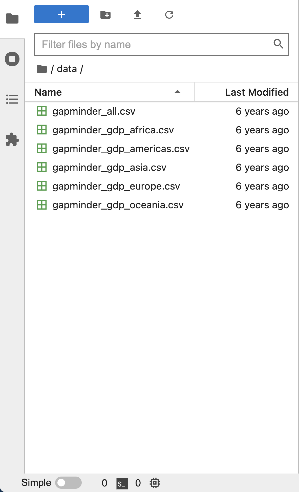
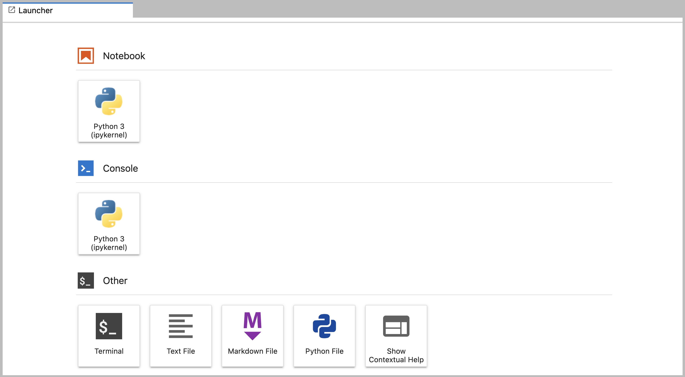

::::::::::::::::::::::::::::::::::::::: objectives

- Starten Sie den JupyterLab-Server.
- Erstellen Sie ein neues Python-Skript.
- Erstellen Sie ein Jupyter-Notizbuch.
- Fahren Sie den JupyterLab-Server herunter.
- Verstehen Sie den Unterschied zwischen einem Python-Skript und einem
  Jupyter-Notizbuch.
- Erstellen von Markdown-Zellen in einem Notizbuch.
- Erstellen und Ausführen von Python-Zellen in einem Notizbuch.

::::::::::::::::::::::::::::::::::::::::::::::::::

:::::::::::::::::::::::::::::::::::::::: questions

- Wie kann ich Python-Programme ausführen?

::::::::::::::::::::::::::::::::::::::::::::::::::

Um Python auszuführen, werden wir für den Rest dieses Workshops [Jupyter
Notebooks][jupyter] über [JupyterLab][jupyterlab] verwenden. Jupyter Notebooks sind in
den Bereichen Datenwissenschaft und Visualisierung weit verbreitet und dienen als
praktischer gemeinsamer Nenner für die interaktive Ausführung von Python-Code, in dem
wir die Ergebnisse unseres Python-Codes leicht ansehen und mit anderen teilen können.

Es gibt andere Möglichkeiten, Code zu bearbeiten, zu verwalten und auszuführen.
Softwareentwickler verwenden häufig eine integrierte Entwicklungsumgebung (IDE) wie
[PyCharm] (https://www.jetbrains.com/pycharm/) oder [Visual Studio Code]
(https://code.visualstudio.com/) oder Texteditoren wie Vim oder Emacs, um ihre
Python-Programme zu erstellen und zu bearbeiten. Nachdem Sie Ihre Python-Programme
bearbeitet und gespeichert haben, können Sie diese Programme in der IDE selbst oder
direkt auf der Kommandozeile ausführen. Im Gegensatz dazu können wir mit
Jupyter-Notizbüchern die Ergebnisse unseres Python-Codes direkt im Notizbuch ausführen
und betrachten.

JupyterLab hat mehrere andere praktische Funktionen:

- Sie können problemlos Codeblöcke eingeben, bearbeiten, kopieren und einfügen.
- Mit der Registerkarte "Vollständig" können Sie leicht auf die Namen der Dinge
  zugreifen, die Sie verwenden, und mehr über sie erfahren.
- Damit können Sie Ihren Code mit Links, Text in verschiedenen Größen,
  Aufzählungszeichen usw. versehen, um ihn für Sie und Ihre Mitarbeiter leichter
  zugänglich zu machen.
- Damit können Sie Zahlen neben dem Code, der sie erzeugt, anzeigen, um eine
  vollständige Geschichte der Analyse zu erzählen.

Jedes Notizbuch enthält eine oder mehrere Zellen, die Code, Text oder Bilder enthalten.

## Erste Schritte mit JupyterLab

JupyterLab ist ein Anwendungsserver mit einer Web-Benutzeroberfläche von [Projekt
Jupyter][jupyter], der es ermöglicht, mit Dokumenten und Aktivitäten wie
Jupyter-Notizbüchern, Texteditoren, Terminals und sogar benutzerdefinierten Komponenten
auf flexible, integrierte und erweiterbare Weise zu arbeiten. JupyterLab erfordert einen
einigermaßen aktuellen Browser (idealerweise eine aktuelle Version von Chrome, Safari
oder Firefox); Internet Explorer Versionen 9 und niedriger werden *nicht* unterstützt.

JupyterLab ist Teil der Anaconda Python Distribution. Wenn Sie die
Anaconda-Python-Distribution noch nicht installiert haben, finden Sie in der
[Setup-Anleitung](../learners/setup.md) eine Installationsanleitung.

In dieser Lektion werden wir JupyterLab lokal auf unseren eigenen Rechnern laufen
lassen, so dass außer der anfänglichen Verbindung zum Herunterladen und Installieren von
Anaconda und JupyterLab keine Internetverbindung erforderlich ist

- Starten Sie den JupyterLab-Server auf Ihrem Rechner
- Verwenden Sie einen Webbrowser, um eine spezielle localhost URL zu öffnen, die eine
  Verbindung zu Ihrem JupyterLab Server herstellt
- Der JupyterLab-Server erledigt die Arbeit und der Webbrowser stellt das Ergebnis dar
- Geben Sie Code in den Browser ein und sehen Sie sich die Ergebnisse an, nachdem Ihr
  JupyterLab-Server die Ausführung Ihres Codes beendet hat

::::::::::::::::::::::::::::::::::::::::: callout

## JupyterLab? Was ist mit Jupyter-Notebooks?

JupyterLab ist die [nächste Entwicklungsstufe des
Jupyter-Notebooks](https://jupyterlab.readthedocs.io/en/stable/getting_started/overview.html#overview).
Wenn Sie bereits Erfahrung mit Jupyter-Notizbüchern haben, dann haben Sie eine gute
Vorstellung davon, was Sie von JupyterLab erwarten können.

Erfahrene Benutzer von Jupyter-Notizbüchern, die an einer ausführlicheren Diskussion der
Ähnlichkeiten und Unterschiede zwischen den Benutzeroberflächen von JupyterLab und
Jupyter-Notizbüchern interessiert sind, finden weitere Informationen in der [JupyterLab
user interface documentation][jupyterlab-ui].


::::::::::::::::::::::::::::::::::::::::::::::::::

## Start von JupyterLab

Sie können den JupyterLab-Server über die Befehlszeile oder über eine Anwendung namens
`Anaconda Navigator` starten. Anaconda Navigator ist Teil der Anaconda Python
Distribution.

### macOS - Befehlszeile

Um den JupyterLab-Server zu starten, müssen Sie über das Terminal auf die Befehlszeile
zugreifen. Es gibt zwei Möglichkeiten, Terminal auf dem Mac zu öffnen.

1. Öffnen Sie in Ihrem Anwendungsordner die Dienstprogramme und doppelklicken Sie auf
   Terminal
2. Drücken Sie <kbd>Befehl</kbd> + <kbd>Leertaste</kbd>, um Spotlight zu starten. Geben
   Sie `Terminal` ein und doppelklicken Sie dann auf das Suchergebnis oder drücken Sie
   <kbd>Eingabe</kbd>

Nachdem Sie Terminal gestartet haben, geben Sie den Befehl ein, um den JupyterLab-Server
zu starten.

```bash
$ jupyter lab
```

### Windows-Benutzer - Befehlszeile

Um den JupyterLab-Server zu starten, müssen Sie auf die Anaconda-Eingabeaufforderung
zugreifen.

Drücken Sie <kbd>Windows Logo Key</kbd> und suchen Sie nach `Anaconda Prompt`, klicken
Sie auf das Ergebnis oder drücken Sie Enter.

Nachdem Sie die Anaconda-Eingabeaufforderung gestartet haben, geben Sie den Befehl ein:

```bash
$ jupyter lab
```

### Anaconda Navigator

Um einen JupyterLab-Server von Anaconda Navigator aus zu starten, müssen Sie zuerst
[Anaconda Navigator starten (klicken Sie hier für detaillierte Anweisungen für macOS,
Windows und
Linux)](https://docs.anaconda.com/free/navigator/getting-started/#navigator-starting-navigator).
Sie können Anaconda Navigator über Spotlight auf macOS (<kbd>Befehl</kbd> +
<kbd>Leertaste</kbd>), die Windows-Suchfunktion (<kbd>Windows-Logo-Taste</kbd>) oder das
Öffnen einer Terminal-Shell und das Ausführen von `anaconda-navigator` über die
Kommandozeile suchen.

Nachdem Sie Anaconda Navigator gestartet haben, klicken Sie auf die Schaltfläche
`Launch` unter JupyterLab. Möglicherweise müssen Sie nach unten scrollen, um sie zu
finden.

Hier ist ein Screenshot einer Anaconda-Navigator-Seite, die der Seite ähnelt, die sich
unter macOS oder Windows öffnen sollte.

<p align='center'>
  
</p>

Und hier ist ein Screenshot einer JupyterLab-Landingpage, die der Seite ähneln sollte,
die sich in Ihrem Standard-Webbrowser öffnet, nachdem Sie den JupyterLab-Server unter
macOS oder Windows gestartet haben.

<p align='center'>
  
</p>

## Die JupyterLab-Schnittstelle

JupyterLab verfügt über viele Funktionen, die in traditionellen integrierten
Entwicklungsumgebungen (IDEs) zu finden sind, konzentriert sich aber auf die
Bereitstellung flexibler Bausteine für interaktives, forschendes Computing.

Die [JupyterLab-Oberfläche][jupyterlab-ui] besteht aus der Menüleiste, einer
ausklappbaren linken Seitenleiste und dem Hauptarbeitsbereich, der Registerkarten mit
Dokumenten und Aktivitäten enthält.

### Menüleiste

Die Menüleiste am oberen Rand von JupyterLab enthält die Menüs der obersten Ebene, in
denen verschiedene in JupyterLab verfügbare Aktionen zusammen mit den entsprechenden
Tastenkombinationen (sofern zutreffend) angezeigt werden. Die folgenden Menüs sind
standardmäßig enthalten.

- **Datei:** Aktionen im Zusammenhang mit Dateien und Verzeichnissen wie *Neu*,
  *Öffnen*, *Schließen*, *Speichern*, usw. Das Menü *Datei* enthält auch die Aktion
  *Abschalten*, mit der Sie den JupyterLab-Server herunterfahren können.
- **Bearbeiten:** Aktionen im Zusammenhang mit der Bearbeitung von Dokumenten und
  anderen Aktivitäten wie *Rückgängig*, *Ausschneiden*, *Kopieren*, *Einfügen*, usw.
- **Ansicht:** Aktionen, die das Aussehen von JupyterLab verändern.
- **Ausführen:** Aktionen zum Ausführen von Code in verschiedenen Aktivitäten wie
  Notizbüchern und Code-Konsolen (siehe unten).
- **Kernel:** Aktionen zur Verwaltung von Kerneln. Kernel in Jupyter werden weiter unten
  ausführlicher erklärt.
- **Tabs:** Eine Liste der geöffneten Dokumente und Aktivitäten im Hauptarbeitsbereich.
- **Einstellungen:** Allgemeine JupyterLab-Einstellungen können über dieses Menü
  konfiguriert werden. Es gibt auch eine Option *Erweiterter Einstellungseditor* im
  Dropdown-Menü, die eine feinere Steuerung der JupyterLab-Einstellungen und
  Konfigurationsoptionen ermöglicht.
- **Hilfe:** Eine Liste von JupyterLab- und Kernel-Hilfe-Links.

::::::::::::::::::::::::::::::::::::::::: callout

## Kernel

Die JupyterLab [docs]
(https://jupyterlab.readthedocs.io/en/stable/user/documents_kernels.html) definieren
Kernel als "separate Prozesse, die vom Server gestartet werden und Ihren Code in
verschiedenen Programmiersprachen und Umgebungen ausführen." Wenn wir ein Jupyter
Notebook öffnen, wird ein Kernel - ein Prozess - gestartet, der den Code ausführt. In
dieser Lektion werden wir den Jupyter ipython-Kernel verwenden, mit dem wir Python
3-Code interaktiv ausführen können.

Die Verwendung anderer Jupyter-[Kernel für andere Programmiersprachen]
(https://github.com/jupyter/jupyter/wiki/Jupyter-kernels) würde es uns ermöglichen, Code
in anderen Programmiersprachen in derselben JupyterLab-Schnittstelle zu schreiben und
auszuführen, wie R, Java, Julia, Ruby, JavaScript, Fortran, usw.

::::::::::::::::::::::::::::::::::::::::::::::::::

Ein Screenshot der Standard-Menüleiste finden Sie unten.

<p align='center'>   
</p>

### Linke Seitenleiste

Die linke Seitenleiste enthält eine Reihe von häufig verwendeten Registerkarten, wie
z.B. einen Dateibrowser (der den Inhalt des Verzeichnisses anzeigt, in dem der
JupyterLab-Server gestartet wurde), eine Liste der laufenden Kernel und Terminals, die
Befehlspalette und eine Liste der geöffneten Registerkarten im Hauptarbeitsbereich.
Nachfolgend finden Sie einen Screenshot der standardmäßigen linken Seitenleiste.

<p align='center'>   
</p>

Die linke Seitenleiste kann durch Auswahl von "Linke Seitenleiste anzeigen" im Menü
"Ansicht" oder durch Klicken auf die aktive Registerkarte der Seitenleiste ein- oder
ausgeklappt werden.

### Hauptarbeitsbereich

Der Hauptarbeitsbereich in JupyterLab ermöglicht es Ihnen, Dokumente (Notizbücher,
Textdateien usw.) und andere Aktivitäten (Terminals, Codekonsolen usw.) in Tafeln mit
Registerkarten anzuordnen, die in der Größe verändert oder unterteilt werden können.
Nachstehend finden Sie einen Screenshot des standardmäßigen Hauptarbeitsbereichs.

Wenn Sie die Registerkarte "Launcher" nicht sehen, klicken Sie auf das blaue Pluszeichen
unter den Menüs "Datei" und "Bearbeiten", damit sie erscheint.

<p align='center'>   
</p>

Ziehen Sie eine Registerkarte in die Mitte eines Registerkartenfeldes, um die
Registerkarte in das Feld zu verschieben. Unterteilen Sie ein Registerkartenfeld, indem
Sie eine Registerkarte nach links, rechts, oben oder unten in das Feld ziehen. Der
Arbeitsbereich hat eine einzige aktuelle Aktivität. Die Registerkarte für die aktuelle
Aktivität ist durch einen farbigen oberen Rand gekennzeichnet (standardmäßig blau).

## Erstellen eines Python-Skripts

- Um mit dem Schreiben eines neuen Python-Programms zu beginnen, klicken Sie auf das
  Textdatei-Symbol unter der Überschrift *Sonstiges* auf der Registerkarte
  "Startprogramm" des Hauptarbeitsbereichs.
  - Sie können auch eine neue einfache Textdatei erstellen, indem Sie *Neu -> Textdatei*
    aus dem Menü *Datei* in der Menüleiste auswählen.
- Um diese einfache Textdatei in ein Python-Programm umzuwandeln, wählen Sie die Aktion
  *Datei speichern unter* aus dem Menü *Datei* in der Menüleiste und geben Sie Ihrer
  neuen Textdatei einen Namen, der mit der Erweiterung `.py` endet.
  - Die Erweiterung `.py` zeigt jedem (auch dem Betriebssystem), dass diese Textdatei
    ein Python-Programm ist.
  - Dies ist eine Konvention, keine Vorschrift.

## Erstellen eines Jupyter-Notebooks

Um ein neues Notebook zu öffnen, klicken Sie auf das Python 3-Symbol unter der
Überschrift *Notebook* in der Registerkarte Launcher im Hauptarbeitsbereich. Sie können
auch ein neues Notizbuch erstellen, indem Sie *Neu -> Notizbuch* aus dem Menü *Datei* in
der Menüleiste wählen.

Zusätzliche Hinweise zu Jupyter-Notizbüchern.

- Notebookdateien haben die Erweiterung `.ipynb`, um sie von reinen Python-Programmen zu
  unterscheiden.
- Notizbücher können als Python-Skripte exportiert werden, die über die Befehlszeile
  ausgeführt werden können.

Nachfolgend sehen Sie einen Screenshot eines Jupyter-Notizbuchs, das in JupyterLab
läuft. Wenn Sie an weiteren Details interessiert sind, dann schauen Sie in die
[offizielle Notebook-Dokumentation][jupyterlab-notebook-docs].

<p align='center'>   
</p>

::::::::::::::::::::::::::::::::::::::::: callout

## Wie wird es gespeichert?

- Die Notizbuchdatei ist in einem Format namens JSON gespeichert.
- Genau wie eine Webseite sieht das, was gespeichert wird, anders aus als das, was Sie
  in Ihrem Browser sehen.
- Aber dieses Format erlaubt es Jupyter, Quellcode, Text und Bilder in einer Datei zu
  mischen.

::::::::::::::::::::::::::::::::::::::::::::::::::

::::::::::::::::::::::::::::::::::::::: challenge

## Anordnen von Dokumenten in Registerkartenfeldern

Im JupyterLab-Hauptarbeitsbereich können Sie Dokumente in Panels mit Registerkarten
anordnen. Hier ist ein Beispiel aus der [offiziellen Dokumentation][jupyterlab].

<p align='center'>   
</p>

Erstellen Sie zunächst eine Textdatei, eine Python-Konsole und ein Terminalfenster und
ordnen Sie diese in drei Panels im Hauptarbeitsbereich an. Erstellen Sie als Nächstes
ein Notizbuch, ein Terminalfenster und eine Textdatei und ordnen Sie diese in drei
Bereichen im Hauptarbeitsbereich an. Erstellen Sie schließlich Ihre eigene Kombination
von Bereichen und Registerkarten. Welche Kombination von Bereichen und Registerkarten
ist Ihrer Meinung nach für Ihren Arbeitsablauf am nützlichsten?

::::::::::::::: solution

## Lösung

Nachdem Sie die erforderlichen Registerkarten erstellt haben, können Sie eine der
Registerkarten in die Mitte eines Bereichs ziehen, um die Registerkarte in den Bereich
zu verschieben; anschließend können Sie einen Registerkartenbereich unterteilen, indem
Sie eine Registerkarte nach links, rechts, oben oder unten in den Bereich ziehen.


:::::::::::::::::::::::::

::::::::::::::::::::::::::::::::::::::::::::::::::

::::::::::::::::::::::::::::::::::::::::: callout

## Code vs. Text

Jupyter mischt Code und Text in verschiedenen Arten von Blöcken, den sogenannten Zellen.
Wir verwenden den Begriff "Code" oft für "den Quellcode von Software, die in einer
Sprache wie Python geschrieben wurde". Eine "Codezelle" in einem Notizbuch ist eine
Zelle, die Software enthält; eine "Textzelle" ist eine Zelle, die normale, für Menschen
geschriebene Prosa enthält.


::::::::::::::::::::::::::::::::::::::::::::::::::

## Das Notebook hat einen Befehls- und einen Bearbeitungsmodus.

- Wenn Sie abwechselnd <kbd>Esc</kbd> und <kbd>Return</kbd> drücken, ändert sich der
  äußere Rand Ihrer Codezelle von grau zu blau.
- Dies sind die Modi **Befehl** (grau) und **Bearbeiten** (blau) Ihres Notizbuchs.
- Im Befehlsmodus können Sie Funktionen auf Notizbuchebene bearbeiten, im
  Bearbeitungsmodus ändern Sie den Inhalt der Zellen.
- Im Befehlsmodus (esc/gray),
  - Mit der Taste <kbd>b</kbd> wird eine neue Zelle unter der aktuell ausgewählten Zelle
    erstellt.
  - Mit der Taste <kbd>a</kbd> können Sie die obige Kombination erstellen.
  - Mit der Taste <kbd>x</kbd> wird die aktuelle Zelle gelöscht.
  - Mit der Taste <kbd>z</kbd> können Sie die letzte Operation in einer Zelle rückgängig
    machen (z. B. Löschen, Erstellen usw.).
- Alle Aktionen können über die Menüs ausgeführt werden, aber es gibt viele
  Tastenkombinationen, um die Arbeit zu beschleunigen.

::::::::::::::::::::::::::::::::::::::: challenge

## Befehl vs. Bearbeiten

Befinden Sie sich auf der Seite des Jupyter-Notizbuchs gerade im Befehls- oder im
Bearbeitungsmodus?  
Wechseln Sie zwischen den beiden Modi. Verwenden Sie die Tastenkombinationen, um eine
neue Zelle zu erstellen. Verwenden Sie die Tastenkombinationen, um eine Zelle zu
löschen. Verwenden Sie die Tastenkombinationen, um die zuletzt durchgeführte
Zellenoperation rückgängig zu machen.

::::::::::::::: solution

## Lösung

Der Befehlsmodus hat einen grauen Rahmen und der Bearbeitungsmodus einen blauen Rahmen.
Verwenden Sie <kbd>Esc</kbd> und <kbd>Return</kbd>, um zwischen den Modi zu wechseln.
Sie müssen sich im Befehlsmodus befinden (drücken Sie <kbd>Esc</kbd>, wenn Ihre Zelle
blau ist). Tippen Sie <kbd>b</kbd> oder <kbd>a</kbd>. Sie müssen sich im Befehlsmodus
befinden (drücken Sie <kbd>Esc</kbd>, wenn Ihre Zelle blau ist). Tippen Sie
<kbd>x</kbd>. Du musst dich im Befehlsmodus befinden (drücke <kbd>Esc</kbd>, wenn deine
Zelle blau ist). Tippe <kbd>z</kbd>.


:::::::::::::::::::::::::

::::::::::::::::::::::::::::::::::::::::::::::::::

### Verwenden Sie die Tastatur und die Maus, um Zellen auszuwählen und zu bearbeiten.

- Wenn Sie die <kbd>Return</kbd>-Taste drücken, wird der Rahmen blau und der
  Bearbeitungsmodus wird aktiviert, so dass Sie innerhalb der Zelle schreiben können.
- Da wir in der Lage sein wollen, viele Codezeilen in einer einzigen Zelle zu schreiben,
  bewegt das Drücken der <kbd>Return</kbd>-Taste im Bearbeitungsmodus (blau) den Cursor
  zur nächsten Zeile in der Zelle, wie in einem Texteditor.
- Wir brauchen einen anderen Weg, um dem Notebook mitzuteilen, dass wir das, was in der
  Zelle steht, ausführen wollen.
- Durch gleichzeitiges Drücken von <kbd>Shift</kbd>+<kbd>Return</kbd> wird der Inhalt
  der Zelle ausgeführt.
- Beachten Sie, dass die Tasten <kbd>Return</kbd> und <kbd>Shift</kbd> auf der rechten
  Seite der Tastatur direkt nebeneinander liegen.

### Das Notebook verwandelt Markdown in eine hübsch gedruckte Dokumentation.

- Notebooks können auch [Markdown][markdown] wiedergeben.
  - Ein einfaches Klartextformat zum Schreiben von Listen, Links und anderen Dingen, die
    auf eine Webseite gehören könnten.
  - Entspricht einer Teilmenge von HTML, die so aussieht, wie man sie in einer
    altmodischen E-Mail verschicken würde.
- Verwandeln Sie die aktuelle Zelle in eine Markdown-Zelle, indem Sie den Befehlsmodus
  (<kbd>Esc</kbd>/grau) aufrufen und die Taste <kbd>M</kbd> drücken.
- `In [ ]:` wird verschwinden, um zu zeigen, dass es sich nicht mehr um eine Codezelle
  handelt und Sie in Markdown schreiben können.
- Verwandeln Sie die aktuelle Zelle in eine Codezelle, indem Sie den Befehlsmodus
  (<kbd>Esc</kbd>/grau) aufrufen und die Taste <kbd>y</kbd> drücken.

### Markdown macht das meiste von dem, was HTML macht.

Tabelle: Zeigt eine Markdown-Syntax und ihre gerenderte Ausgabe.

+---------------------------------------+------------------------------------------------+
| Markdown code                         | Rendered output                                |
+=======================================+================================================+
+---------------------------------------+------------------------------------------------+
| ```                                   | <p></p>                                        |
| *   Use asterisks                     | -   Use asterisks                              |
| *   to create                         | -   to create                                  |
| *   bullet lists.                     | -   bullet lists.                              |
| ```                                   |                                                |
+---------------------------------------+------------------------------------------------+
+---------------------------------------+------------------------------------------------+
| ```                                   | <p></p>                                        |
| 1.   Use numbers                      | 1.   Use numbers                               |
| 1.   to create                        | 2.   to create                                 |
| 1.   bullet lists.                    | 3.   numbered lists.                           |
| ```                                   |                                                |
+---------------------------------------+------------------------------------------------+
+---------------------------------------+------------------------------------------------+
| ```                                   | <p></p>                                        |
| *  You can use indents                | - You can use indents                          |
|   *  To create sublists               |   - To create sublists                         |
|   *  of the same type                 |   - of the same type                           |
| *  Or sublists                        | - Or sublists                                  |
|   1. Of different                     |   1. Of different                              |
|   1. types                            |   2. types                                     |
| ```                                   |                                                |
+---------------------------------------+------------------------------------------------+
+---------------------------------------+------------------------------------------------+
| ```                                   | <p></p>                                        |
| # A Level-1 Heading                   | ## A Level-1 Heading                           |
| ```                                   |                                                |
+---------------------------------------+------------------------------------------------+
+---------------------------------------+------------------------------------------------+
| ```                                   | <p></p>                                        |
| ## A Level-2 Heading (etc.)           | ### A Level-2 Heading (etc.)                   |
| ```                                   |                                                |
+---------------------------------------+------------------------------------------------+
+---------------------------------------+------------------------------------------------+
| ```                                   | <p></p>                                        |
| Line breaks                           | Line breaks                                    |
| don't matter.                         | don't matter.                                  |
|                                       |                                                |
| But blank lines                       | But blank lines                                |
| create new paragraphs.                | create new paragraphs.                         |
| ```                                   |                                                |
+---------------------------------------+------------------------------------------------+
+---------------------------------------+------------------------------------------------+
| ```                                   | <p></p>                                        |
| [Links](http://software-carpentry.org)| [Links](https://software-carpentry.org)        |
| are created with `[...](...)`.        | are created with `[...](...)`.                 |
| Or use [named links][data-carp].      | Or use [named links][data_carpentry].          |
|                                       |                                                |
| [data-carp]: http://datacarpentry.org |                                                |
| ```                                   |                                                |
+---------------------------------------+------------------------------------------------+

::::::::::::::::::::::::::::::::::::::: challenge

## Erstellen von Listen in Markdown

Erstellen Sie eine verschachtelte Liste in einer Markdown-Zelle in einem Notizbuch, die
wie folgt aussieht:

1. Finanzierung erhalten.
2. Arbeiten Sie.
  - Entwurfsexperiment.
  - Daten sammeln.
  - Analysieren.
3. Schreiben Sie.
4. Veröffentlichen.

::::::::::::::: solution

## Lösung

Diese Aufgabe integriert sowohl die nummerierte Liste als auch die Aufzählungsliste.
Beachten Sie, dass die Aufzählungsliste um 2 Leerzeichen eingerückt ist, so dass sie mit
den Elementen der nummerierten Liste übereinstimmt.

```
1.  Get funding.
2.  Do work.
    *   Design experiment.
    *   Collect data.
    *   Analyze.
3.  Write up.
4.  Publish.
```

:::::::::::::::::::::::::

::::::::::::::::::::::::::::::::::::::::::::::::::

::::::::::::::::::::::::::::::::::::::: challenge

## Mehr Mathematik

Was wird angezeigt, wenn eine Python-Zelle in einem Notizbuch, das mehrere Berechnungen
enthält, ausgeführt wird? Was passiert zum Beispiel, wenn diese Zelle ausgeführt wird?

```python
7 * 3
2 + 1
```

::::::::::::::: solution

## Lösung

Python gibt die Ausgabe der letzten Berechnung zurück.

```python
3
```

:::::::::::::::::::::::::

::::::::::::::::::::::::::::::::::::::::::::::::::

::::::::::::::::::::::::::::::::::::::: challenge

## Vorhandene Zelle von Code in Markdown ändern

Was passiert, wenn Sie etwas Python in eine Codezelle schreiben und dann in eine
Markdown-Zelle wechseln? Geben Sie zum Beispiel Folgendes in eine Code-Zelle ein:

```python
x = 6 * 7 + 12
print(x)
```

Und dann führen Sie es mit <kbd>Shift</kbd>\+<kbd>Return</kbd> aus, um sicherzustellen,
dass es als Codezelle funktioniert. Gehen Sie nun zurück zu der Zelle und verwenden Sie
<kbd>Esc</kbd> und dann <kbd>m</kbd>, um die Zelle in Markdown umzuwandeln und sie mit
<kbd>Shift</kbd>\+<kbd>Return</kbd> "auszuführen". Was ist passiert und wie könnte dies
nützlich sein?

::::::::::::::: solution

## Lösung

Der Python-Code wird wie Markdown-Text behandelt. Die Zeilen erscheinen als Teil eines
zusammenhängenden Absatzes. Dies könnte nützlich sein, um Zellen in Notizbüchern, die
für mehrere Zwecke verwendet werden, vorübergehend ein- und auszuschalten.

```python
x = 6 * 7 + 12 print(x)
```

:::::::::::::::::::::::::

::::::::::::::::::::::::::::::::::::::::::::::::::

::::::::::::::::::::::::::::::::::::::: challenge

## Gleichungen

Standard Markdown (wie wir es für diese Notizen verwenden) kann keine Gleichungen
darstellen, aber das Notebook schon. Erstellen Sie eine neue Markdown-Zelle und geben
Sie Folgendes ein:

```
$\sum_{i=1}^{N} 2^{-i} \approx 1$
```

(Es ist wahrscheinlich einfacher, zu kopieren und einzufügen.) Was wird dort angezeigt?
Was denken Sie, was der Unterstrich, `_`, der Zirkumflex, `^`, und das Dollarzeichen,
`$`, bedeuten?

::::::::::::::: solution

## Lösung

Das Notizbuch zeigt die Gleichung so, wie sie in der LaTeX-Gleichungssyntax dargestellt
werden würde. Das Dollarzeichen, `$`, wird verwendet, um Markdown mitzuteilen, dass der
Text dazwischen eine LaTeX-Gleichung ist. Wenn Sie mit LaTeX nicht vertraut sind, wird
der Unterstrich, `_`, für tiefgestellte Zeichen und der Zirkumflex, `^`, für
hochgestellte Zeichen verwendet. Ein Paar geschweifter Klammern, `{` und `}`, wird
verwendet, um Text zusammenzufassen, so dass die Anweisung `i=1` zum tiefgestellten und
`N` zum hochgestellten Zeichen wird. In ähnlicher Weise steht `-i` in geschweiften
Klammern, um die gesamte Anweisung zum hochgestellten Zeichen für `2` zu machen.`\sum`
und `\approx` sind LaTeX-Befehle für "Summe über" und "Näherungswert" Symbole.


:::::::::::::::::::::::::

::::::::::::::::::::::::::::::::::::::::::::::::::

## Schließen von JupyterLab

- Wählen Sie in der Menüleiste das Menü "Datei" und wählen Sie dann unten im
  Dropdown-Menü "Herunterfahren". Sie werden aufgefordert, zu bestätigen, dass Sie den
  JupyterLab-Server herunterfahren möchten (vergessen Sie nicht, Ihre Arbeit zu
  speichern!). Klicken Sie auf "Herunterfahren", um den JupyterLab-Server
  herunterzufahren.
- Um den JupyterLab-Server neu zu starten, müssen Sie den folgenden Befehl von einer
  Shell aus erneut ausführen.

```
$ jupyter lab
```

::::::::::::::::::::::::::::::::::::::: challenge

## Schließen von JupyterLab

Üben Sie das Schließen und Neustarten des JupyterLab-Servers.


::::::::::::::::::::::::::::::::::::::::::::::::::


[jupyterlab]: https://jupyterlab.readthedocs.io/en/stable/
[jupyterlab-ui]: https://jupyterlab.readthedocs.io/en/stable/user/interface.html
[jupyterlab-notebook-docs]:
https://jupyterlab.readthedocs.io/en/stable/user/notebook.html
[markdown]: https://en.wikipedia.org/wiki/Markdown
[data_carpentry]: https://datacarpentry.org


:::::::::::::::::::::::::::::::::::::::: keypoints

- Python-Skripte sind reine Textdateien.
- Verwenden Sie das Jupyter-Notebook für die Bearbeitung und Ausführung von Python.
- Das Notebook hat einen Befehls- und einen Bearbeitungsmodus.
- Verwenden Sie die Tastatur und die Maus, um Zellen auszuwählen und zu bearbeiten.
- Das Notebook verwandelt Markdown in eine hübsch gedruckte Dokumentation.
- Markdown macht das meiste von dem, was HTML macht.

::::::::::::::::::::::::::::::::::::::::::::::::::


