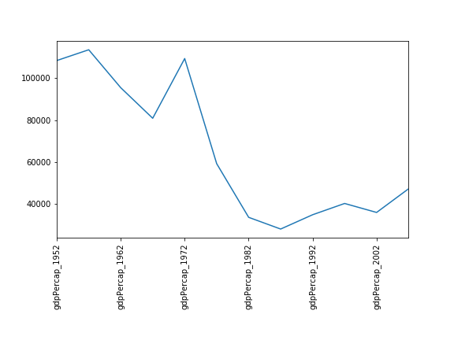

::::::::::::::::::::::::::::::::::::::: objectives

- Erstellt ein Zeitseriendiagramm mit einem einzelnen Datensatz.
- Erstellt ein Streudiagramm, das die Beziehung zwischen zwei Datensätzen zeigt.

::::::::::::::::::::::::::::::::::::::::::::::::::

:::::::::::::::::::::::::::::::::::::::: questions

- Wie kann ich meine Daten darstellen?
- Wie kann ich meinen Plot für die Veröffentlichung speichern?

::::::::::::::::::::::::::::::::::::::::::::::::::

## [`matplotlib`](https://matplotlib.org/) ist die am weitesten verbreitete wissenschaftliche Plotting-Bibliothek in Python.

- Üblicherweise wird eine Unterbibliothek namens
  [`matplotlib.pyplot`](https://matplotlib.org/stable/tutorials/introductory/pyplot.html)
  verwendet.
- Das Jupyter Notebook rendert Plots standardmäßig inline.

```python
import matplotlib.pyplot as plt
```

- Einfache Diagramme sind dann (relativ) einfach zu erstellen.

```python
time = [0, 1, 2, 3]
position = [0, 100, 200, 300]

plt.plot(time, position)
plt.xlabel('Time (hr)')
plt.ylabel('Position (km)')
```

{alt='Ein Liniendiagramm, das die Zeit (Std.)
relativ zur Position (km) anzeigt, unter Verwendung der im obigen Codeblock angegebenen
Werte. Standardmäßig ist die gezeichnete Linie blau vor weißem Hintergrund, und die
Achsen wurden automatisch skaliert, um sie an den Bereich der Eingabedaten anzupassen.'}

::::::::::::::::::::::::::::::::::::::::: callout

## Alle offenen Abbildungen anzeigen

In unserem Jupyter-Notebook-Beispiel sollte das Ausführen der Zelle die Abbildung direkt
unterhalb des Codes erzeugen. Die Abbildung wird auch in das Notebook-Dokument
aufgenommen und kann später betrachtet werden. Andere Python-Umgebungen wie eine
interaktive Python-Sitzung, die von einem Terminal aus gestartet wird, oder ein
Python-Skript, das über die Kommandozeile ausgeführt wird, erfordern jedoch einen
zusätzlichen Befehl, um die Abbildung anzuzeigen.

Weist `matplotlib` an, eine Figur darzustellen:

```python
plt.show()
```

Dieser Befehl kann auch innerhalb eines Notizbuchs verwendet werden - zum Beispiel, um
mehrere Zahlen anzuzeigen, wenn mehrere von einer einzigen Zelle erstellt wurden.

::::::::::::::::::::::::::::::::::::::::::::::::::

## Plotten von Daten direkt aus einem [`Pandas dataframe`](https://pandas.pydata.org/pandas-docs/stable/reference/api/pandas.DataFrame.html).

- Wir können auch [Pandas
  dataframes](https://pandas.pydata.org/pandas-docs/stable/generated/pandas.DataFrame.html)
  plotten.
- Vor dem Plotten konvertieren wir die Spaltenüberschriften von einem `string`-Datentyp
  in `integer`, da sie numerische Werte darstellen, indem wir
  [str.replace()](https://pandas.pydata.org/docs/reference/api/pandas.Series.str.replace.html)
  verwenden, um das Präfix `gpdPercap_` zu entfernen, und dann
  [astype(int)](https://pandas.pydata.org/docs/reference/api/pandas.Series.astype.html),
  um die Reihe von String-Werten (`['1952', '1957', ..., '2007']`) in eine Reihe von
  Ganzzahlen zu konvertieren: `[1925, 1957, ..., 2007]`.

```python
import pandas as pd

data = pd.read_csv('data/gapminder_gdp_oceania.csv', index_col='country')

# Extract year from last 4 characters of each column name
# The current column names are structured as 'gdpPercap_(year)', 
# so we want to keep the (year) part only for clarity when plotting GDP vs. years
# To do this we use replace(), which removes from the string the characters stated in the argument
# This method works on strings, so we use replace() from Pandas Series.str vectorized string functions

years = data.columns.str.replace('gdpPercap_', '')

# Convert year values to integers, saving results back to dataframe

data.columns = years.astype(int)

data.loc['Australia'].plot()
```

{alt='BIP-Darstellung für Australien'}

## Wählen Sie Daten aus, transformieren Sie sie und stellen Sie sie dann dar.

- Standardmäßig zeichnet
  [`DataFrame.plot`](https://pandas.pydata.org/pandas-docs/stable/generated/pandas.DataFrame.plot.html#pandas.DataFrame.plot)
  mit den Zeilen als X-Achse.
- Wir können die Daten transponieren, um mehrere Reihen zu zeichnen.

```python
data.T.plot()
plt.ylabel('GDP per capita')
```

{alt='BIP-Darstellung für Australien und Neuseeland'}

## Es stehen viele Darstellungsarten zur Verfügung.

- Erstellen Sie z. B. ein Balkendiagramm mit einem ausgefeilteren Stil.

```python
plt.style.use('ggplot')
data.T.plot(kind='bar')
plt.ylabel('GDP per capita')
```

{alt='BIP-Balkenplot für Australien'}

## Daten können auch durch direkten Aufruf der Funktion `matplotlib` `plot` geplottet werden.

- Der Befehl lautet `plt.plot(x, y)`
- Die Farbe und das Format der Marker können auch als zusätzliches optionales Argument
  angegeben werden, z.B. `b-` ist eine blaue Linie, `g--` ist eine grüne gestrichelte
  Linie.

## Holt Australien-Daten aus dem Datenrahmen

```python
years = data.columns
gdp_australia = data.loc['Australia']

plt.plot(years, gdp_australia, 'g--')
```

{alt='BIP-formatierte Darstellung für Australien'}

## Kann viele Datensätze zusammen darstellen.

```python
# Select two countries' worth of data.
gdp_australia = data.loc['Australia']
gdp_nz = data.loc['New Zealand']

# Plot with differently-colored markers.
plt.plot(years, gdp_australia, 'b-', label='Australia')
plt.plot(years, gdp_nz, 'g-', label='New Zealand')

# Create legend.
plt.legend(loc='upper left')
plt.xlabel('Year')
plt.ylabel('GDP per capita ($)')
```

::::::::::::::::::::::::::::::::::::::::: callout

## Hinzufügen einer Legende

Beim Plotten mehrerer Datensätze auf derselben Abbildung ist es oft wünschenswert, eine
Legende zur Beschreibung der Daten zu haben.

Dies kann in `matplotlib` in zwei Stufen erfolgen:

- Geben Sie eine Beschriftung für jeden Datensatz in der Abbildung an:

```python
plt.plot(years, gdp_australia, label='Australia')
plt.plot(years, gdp_nz, label='New Zealand')
```

- Weist `matplotlib` an, die Legende zu erstellen.

```python
plt.legend()
```

Standardmäßig versucht matplotlib, die Legende an einer geeigneten Stelle zu platzieren.
Wenn Sie lieber eine Position angeben möchten, können Sie dies mit dem Argument `loc=`
tun, z.B. um die Legende in der oberen linken Ecke des Plots zu platzieren, geben Sie
`loc='upper left'` an

::::::::::::::::::::::::::::::::::::::::::::::::::

{alt='BIP-formatierte Darstellung für
Australien und Neuseeland'}

- Plotten eines Streudiagramms, das das BIP von Australien und Neuseeland in Beziehung
  setzt
- Verwenden Sie entweder `plt.scatter` oder `DataFrame.plot.scatter`

```python
plt.scatter(gdp_australia, gdp_nz)
```

{alt='BIP-Korrelation mit plt.scatter'}

```python
data.T.plot.scatter(x = 'Australia', y = 'New Zealand')
```

{alt='BIP-Korrelation mit data.T.plot.scatter'}

::::::::::::::::::::::::::::::::::::::: challenge

## Minima und Maxima

Füllen Sie die folgenden Felder aus, um das minimale Pro-Kopf-BIP aller europäischen
Länder im Zeitverlauf darzustellen. Ändern Sie das Diagramm erneut, um das maximale
Pro-Kopf-BIP für Europa im Zeitverlauf darzustellen.

```python
data_europe = pd.read_csv('data/gapminder_gdp_europe.csv', index_col='country')
data_europe.____.plot(label='min')
data_europe.____
plt.legend(loc='best')
plt.xticks(rotation=90)
```

::::::::::::::: solution

## Lösung

```python
data_europe = pd.read_csv('data/gapminder_gdp_europe.csv', index_col='country')
data_europe.min().plot(label='min')
data_europe.max().plot(label='max')
plt.legend(loc='best')
plt.xticks(rotation=90)
```

{alt='Minima Maxima Lösung'}


:::::::::::::::::::::::::

::::::::::::::::::::::::::::::::::::::::::::::::::

::::::::::::::::::::::::::::::::::::::: challenge

## Korrelationen

Ändern Sie das Beispiel in den Anmerkungen, um ein Streudiagramm zu erstellen, das die
Beziehung zwischen dem minimalen und maximalen Pro-Kopf-BIP der asiatischen Länder für
jedes Jahr im Datensatz zeigt. Welche Beziehung sehen Sie (wenn überhaupt)?

::::::::::::::: solution

## Lösung

```python
data_asia = pd.read_csv('data/gapminder_gdp_asia.csv', index_col='country')
data_asia.describe().T.plot(kind='scatter', x='min', y='max')
```

{alt='Korrelationen Lösung 1'}

Es sind keine besonderen Korrelationen zwischen den Mindest- und Höchstwerten des BIP
von Jahr zu Jahr zu erkennen. Es scheint, als ob die Geschicke der asiatischen Länder
nicht gemeinsam steigen und fallen.


:::::::::::::::::::::::::

Sie werden feststellen, dass die Variabilität des Maximums viel größer ist als die des
Minimums. Schauen Sie sich die Indizes Maximum und Maximum an:

```python
data_asia = pd.read_csv('data/gapminder_gdp_asia.csv', index_col='country')
data_asia.max().plot()
print(data_asia.idxmax())
print(data_asia.idxmin())
```

::::::::::::::: solution

## Lösung

{alt='Korrelationen Lösung 2'}

Es scheint, dass die Schwankungen in diesem Wert auf einen starken Rückgang nach 1972
zurückzuführen sind. Vielleicht sind geopolitische Gründe im Spiel? Angesichts der
Dominanz der Erdöl produzierenden Länder wäre vielleicht der Brent-Rohöl-Index ein
interessanter Vergleich? Während Myanmar durchweg das niedrigste BIP aufweist, sind die
Schwankungen bei der Nation mit dem höchsten BIP noch ausgeprägter.


:::::::::::::::::::::::::

::::::::::::::::::::::::::::::::::::::::::::::::::

::::::::::::::::::::::::::::::::::::::: challenge

## Weitere Korrelationen

Dieses kurze Programm erstellt ein Diagramm, das die Korrelation zwischen dem BIP und
der Lebenserwartung für das Jahr 2007 zeigt, wobei die Markergröße durch die Bevölkerung
normalisiert wird:

```python
data_all = pd.read_csv('data/gapminder_all.csv', index_col='country')
data_all.plot(kind='scatter', x='gdpPercap_2007', y='lifeExp_2007',
              s=data_all['pop_2007']/1e6)
```

Erläutern Sie anhand der Online-Hilfe und anderer Quellen, was die einzelnen Argumente
von `plot` bewirken.

::::::::::::::: solution

## Lösung

{alt='More Correlations Solution'}

Eine gute Anlaufstelle ist die Dokumentation für die Plot-Funktion -
help(data\_all.plot).

kind - Wie bereits gesehen, bestimmt dies die Art der Darstellung, die gezeichnet werden
soll.

x und y - Ein Spaltenname oder Index, der bestimmt, welche Daten auf der x- und y-Achse
des Diagramms platziert werden sollen

s - Details dazu finden Sie in der Dokumentation von plt.scatter. Eine einzelne Zahl
oder ein Wert für jeden Datenpunkt. Bestimmt die Größe der gezeichneten Punkte.


:::::::::::::::::::::::::

::::::::::::::::::::::::::::::::::::::::::::::::::

::::::::::::::::::::::::::::::::::::::::: callout

## Speichern der Darstellung in einer Datei

Wenn Sie mit der Darstellung zufrieden sind, möchten Sie sie vielleicht in einer Datei
speichern, um sie in eine Veröffentlichung aufzunehmen. Im Modul matplotlib.pyplot gibt
es eine Funktion, mit der dies möglich ist:
[savefig](https://matplotlib.org/stable/api/_as_gen/matplotlib.pyplot.savefig.html). Der
Aufruf dieser Funktion, z.B. mit

```python
plt.savefig('my_figure.png')
```

speichert die aktuelle Abbildung in der Datei `my_figure.png`. Das Dateiformat wird
automatisch aus der Dateinamenerweiterung abgeleitet (andere Formate sind pdf, ps, eps
und svg).

Beachten Sie, dass die Funktionen in `plt` auf eine globale Figurvariable verweisen.
Nachdem eine Figur auf dem Bildschirm angezeigt wurde (z.B. mit `plt.show`), wird
matplotlib diese Variable auf eine neue leere Figur verweisen lassen. Stellen Sie daher
sicher, dass Sie `plt.savefig` aufrufen, bevor der Plot auf dem Bildschirm angezeigt
wird, sonst könnten Sie eine Datei mit einem leeren Plot vorfinden.

Bei der Verwendung von Datenrahmen werden die Daten oft in einer einzigen Zeile erzeugt
und auf dem Bildschirm dargestellt. Zusätzlich zur Verwendung von `plt.savefig` können
wir einen Verweis auf die aktuelle Abbildung in einer lokalen Variablen (mit `plt.gcf`)
speichern und die Klassenmethode `savefig` von dieser Variablen aus aufrufen, um die
Abbildung in einer Datei zu speichern.

```python
data.plot(kind='bar')
fig = plt.gcf() # get current figure
fig.savefig('my_figure.png')
```

::::::::::::::::::::::::::::::::::::::::::::::::::

::::::::::::::::::::::::::::::::::::::::: callout

## Zugänglich machen von Plots

Wenn Sie Diagramme für ein Papier oder eine Präsentation erstellen, gibt es ein paar
Dinge, die Sie tun können, um sicherzustellen, dass jeder Ihre Diagramme verstehen kann.

- Stellen Sie immer sicher, dass Ihr Text groß genug ist, um ihn zu lesen. Verwenden Sie
  den Parameter `fontsize` in `xlabel`, `ylabel`, `title` und `legend`, und
  [`tick_params` mit
  `labelsize`](https://matplotlib.org/stable/api/_as_gen/matplotlib.axes.Axes.tick_params.html),
  um die Textgröße der Zahlen auf Ihren Achsen zu erhöhen.
- In ähnlicher Weise sollten Sie die Elemente Ihres Graphen gut sichtbar machen.
  Benutzen Sie `s`, um die Größe Ihrer Streudiagramm-Markierungen zu erhöhen und
  `linewidth`, um die Größe Ihrer Diagrammlinien zu erhöhen.
- Die Verwendung von Farbe (und nichts anderem) zur Unterscheidung zwischen
  verschiedenen Plot-Elementen macht Ihre Plots unlesbar für jeden, der farbenblind ist
  oder zufällig einen Schwarz-Weiß-Bürodrucker hat. Für Linien können Sie mit dem
  Parameter `linestyle` verschiedene Linientypen verwenden. Bei Streudiagrammen können
  Sie mit `marker` die Form der Punkte ändern. Wenn Sie sich mit den Farben nicht sicher
  sind, können Sie
  [Coblis](https://www.color-blindness.com/coblis-color-blindness-simulator/) oder
  [Color Oracle](https://colororacle.org/) verwenden, um zu simulieren, wie Ihre
  Diagramme für Menschen mit Farbenblindheit aussehen würden.

::::::::::::::::::::::::::::::::::::::::::::::::::

:::::::::::::::::::::::::::::::::::::::: keypoints

- [`matplotlib`](https://matplotlib.org/) ist die am weitesten verbreitete
  wissenschaftliche Plotting-Bibliothek in Python.
- Plotten von Daten direkt aus einem Pandas-Datenframe.
- Wählen Sie Daten aus, transformieren Sie sie und stellen Sie sie dann dar.
- Es stehen viele Darstellungsarten zur Verfügung: Weitere Optionen finden Sie in der
  [Python Graph Gallery](https://python-graph-gallery.com/matplotlib/).
- Kann viele Datensätze zusammen darstellen.

::::::::::::::::::::::::::::::::::::::::::::::::::


